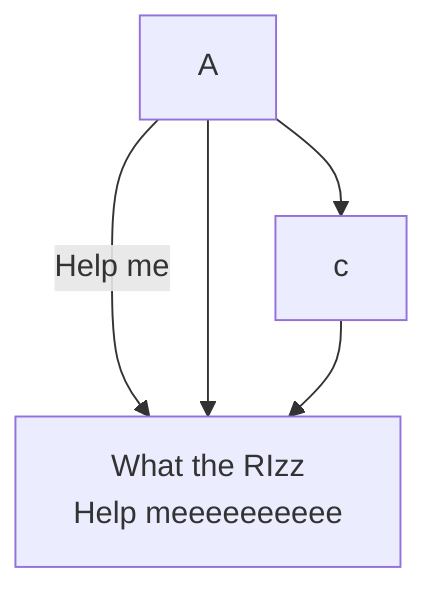
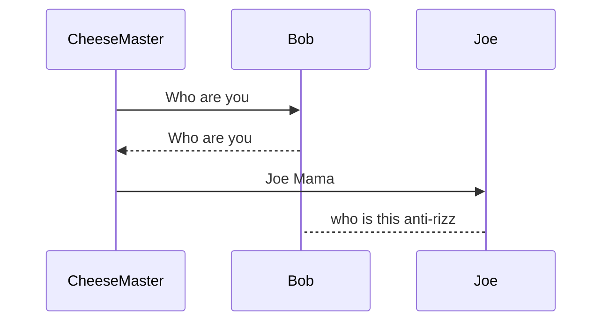

# Headers
This is for **heading 1**

## Headers
This is for **heading 1**

### Headers
This is for **heading 1**

# list

 This is how you list item in markdown
 1. Member 1
    * Team leader

 2. Member 2
    * Team leader

 3. Member 3
    * Team leader


# inserting a imgae

To inserta a image you will need to dray while holding shift then drop


[Click here to link](https://www.youtube.com/watch?v=qIni85BKqqc)

[Clockhere to otomj to test.md][text](Test.md)


# Code Block

To highlight or insert a section of code do the following

1. in raspberrypi , if you want to update you will `sudo apt update`

```
from tkniter import*

main = Tk()

main.mainloop()
```


# Quote

A famous quote by **Jun Ting**
> Is it becuse you are the Cheesy master

# Tables

This is how you insert tables

|Header A|Header B|Header C|
|--------|--------|--------|
|row 1   |RowA    |Row b   |
|row 1   |RowA    |Row b   |
|row 1   |RowA    |Row b   |
|row 1   |RowA    |Row b   |
|row 1 |RowA |Row b|


```

|-----:| This is to Justify Right
```


# Horizontal Rule

This is how to insert a section line

---


# Flowchart




---


# Sequence




